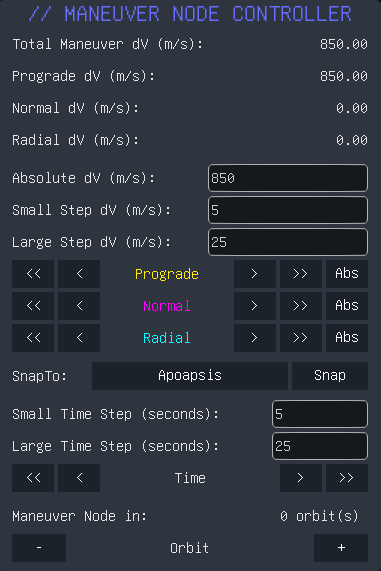

# Maneuver Node Controller
 Provides an interface to finely tune maneuver nodes. Enable the GUI with ALT + N when controlling a vessel.
 

 # Installation Instructions
 1. Install BepInEx mod loader with Space Warp 4.0 and run the game, then close it. Space Warp 4.0 can be found here: https://github.com/SpaceWarpDev/SpaceWarp/releases/tag/spacewarp-0.4.0
 2. Place `BepInEx` folder in your KSP root directory under your game install at `SteamLibrary\steamapps\common\Kerbal Space Program 2\`. The final path will look like: `Kerbal Space Program 2\BepInEx\plugins\maneuver_node_controller`.

# License
Maneuver Node Controller is distributed under the CC BY-SA 4.0 license.
https://creativecommons.org/licenses/by-sa/4.0/

# Attribution
GUI code and `.csproj` file based off Lazy Orbit by https://github.com/Halbann.
Original code base by https://https://github.com/XYZ3211.

